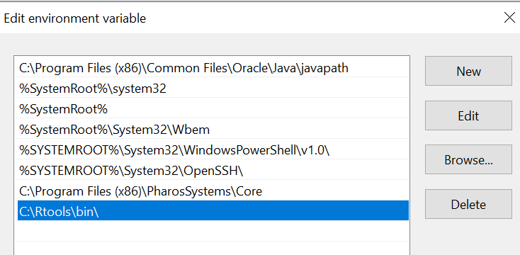

Download the source file from [Compile Hadley’s Advanced R to a PDF](http://brettklamer.com/diversions/statistical/compile-hadleys-advanced-r-programming-to-a-pdf/). Install R Package dependencies using `devtools::install_github("hadley/sloop")` and `devtools::install_github("hadley/emo")`. Finanlly, use `bookdown::render_book("index.Rmd", output_format = "bookdown::pdf_book")` to compile the book.

During the building process, I've met several problems, like missing packages, and other warning messages. The followings are the errors I've met and how I solve them. 


## "xelatex" not found

According to the reference [TinyTex](https://yihui.name/tinytex/#for-r-users). Install *TinyTex* might fix this problem, but I still got other problems. In the end, I used *MiKTeX* instead.
Be careful, choose "*Always install missing packages on-the-fly*" when *MiKTeX* let you choose whether missing packages are to be installed.

```{r}

```

## 'make' not found

After installed *Rtools*, I received this warning *In system(cmd) : 'make' not found*. To solve this problem, I added a path in the system settings as the picture shown below.
```{r}

```


## Missing Packages

Most of the warnings are packages missing. Use `install.packages()` to solve this kind of problem. Some of the packages I installed during the process are *bookdown*, *lobstr*, *DBI*, *lobstr*, *bench*, and *dbplyr*.


## Fonts

I installed two fonts,*Inconsolata* and *AndaleMono*, to get the code worked properly. These two fonts are not packages in R, they should be installed on the computer.

```{r}

```

Like I mentioned above, I didn't compile the PDF using *TinyTex*. After installed *TinyTex*, the warning messages "*Package fontspec Error: The font "Inconsolata" cannot be found*" shown up. Download the font file from the Internet and installed it didn't solve this problem, so I installed MiKTeX instead.